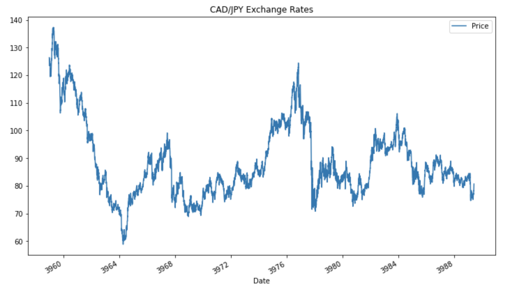
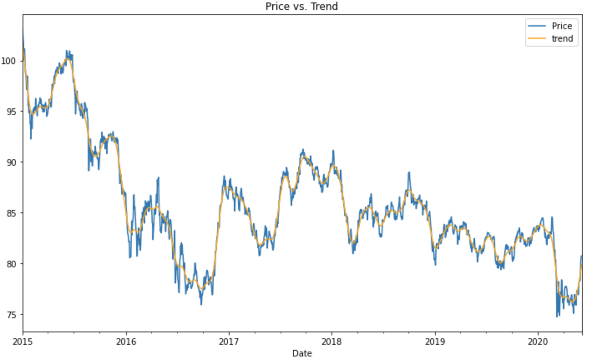

# Machine Learning Homework - Unit 10 A Yen for the Future
## Predicting future exchange rates between the Canadian Dollar (CAD) and Japanese Yen (JPY)

  

  

The following assignment forecasts future exchange rates and volatility between the Canadian Dollar (CAD) and Japanese Yen (JPY) using Time-Series and Linear Regression forecasting. Linear Regression, ARMA, and ARIMA models are used to forecast future exchange rates, while the GARCH model is used to predict future price volatility.

Exchange rates from Jan 1, 1990 through to June 4, 2020 are used as inputs for each model. Forecasts predict the future 5 days.

*Notebooks*
* time_series_analysis.ipynb contains the ARMA, ARIMA, and GARCH models

* regression_analysis.ipynb contains the Linear Regression Model 

----
## Homework questions

**Time-Series Forecasting**
1. Based on your time series analysis, would you buy the yen now?
    * Yes - while the yen does show an increase in volatility, yen has shown a long trend of appreciation against the dollar.

2. Is the risk of the yen expected to increase or decrease?
    * Increase

3. Based on the model evaluation, would you feel confident in using these models for trading?
    * No

**Linear Regression Forecasting**
1. Does this model perform better or worse on out-of-sample data compared to in-sample data?
    * The model performs better on the out-of-sample data based on the Root Mean Squared Error

